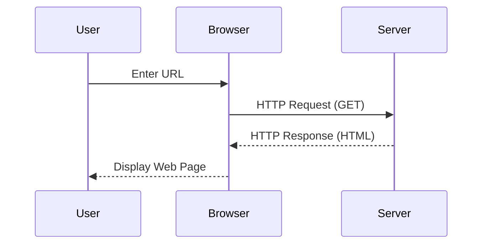

# Exercise 0.4 - New Note Diagram

# HTTP Request Flow

```mermaid
sequenceDiagram
    participant U as User
    participant B as Browser
    participant S as Server

    U->>B: Enter URL
    B->>S: HTTP Request (GET)
    S-->>B: HTTP Response (HTML)
    B-->>U: Display Web Page
```