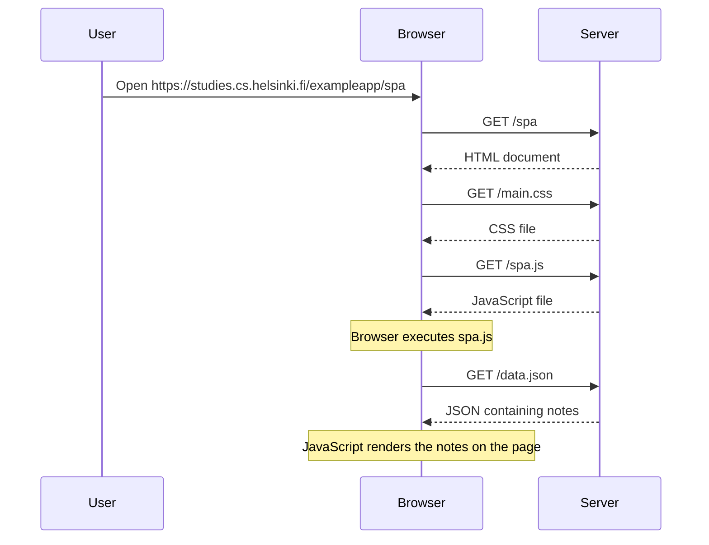

# 0.5 Exercise

```mermaid
sequenceDiagram
    participant User
    participant Browser
    participant Server

    User->>Browser: Open https://studies.cs.helsinki.fi/exampleapp/spa

    Browser->>Server: GET /spa
    Server-->>Browser: HTML document

    Browser->>Server: GET /main.css
    Server-->>Browser: CSS file

    Browser->>Server: GET /spa.js
    Server-->>Browser: JavaScript file

    Note over Browser: Browser executes spa.js

    Browser->>Server: GET /data.json
    Server-->>Browser: JSON containing notes

    Note over Browser: JavaScript renders the notes on the page
```