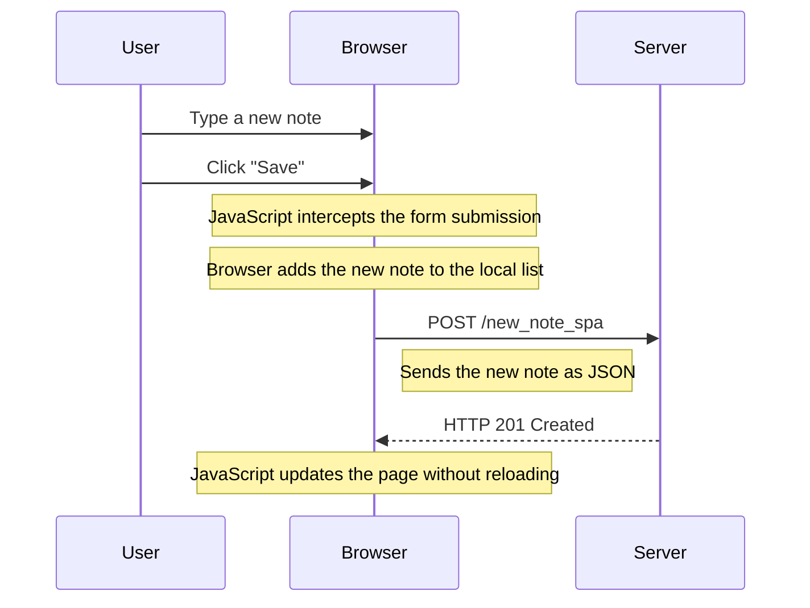

# 0.6 exercise

```mermaid
sequenceDiagram
    participant User
    participant Browser
    participant Server

    User->>Browser: Type a new note
    User->>Browser: Click "Save"

    Note over Browser: JavaScript intercepts the form submission
    Note over Browser: Browser adds the new note to the local list

    Browser->>Server: POST /new_note_spa
    Note right of Browser: Sends the new note as JSON

    Server-->>Browser: HTTP 201 Created

    Note over Browser: JavaScript updates the page without reloading
```